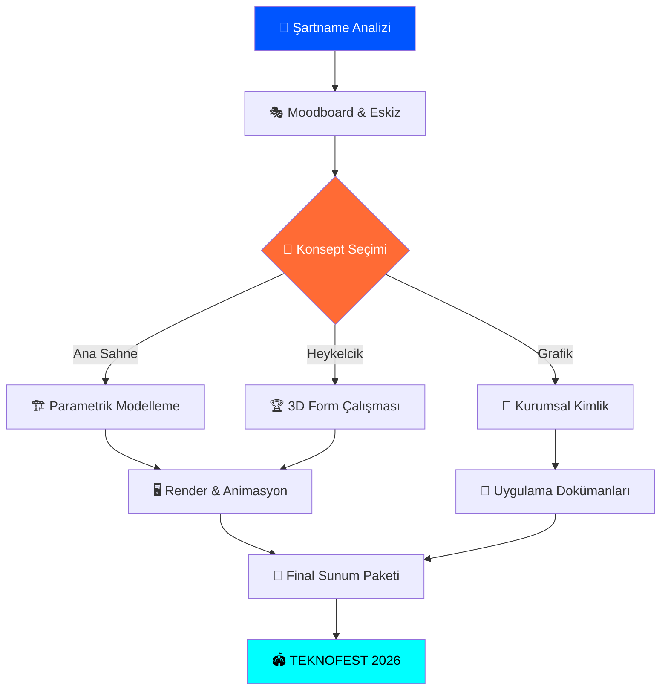

<p align="center">
  
</p>

<p align="center">
  
  
  
  
</p>

<p align="center">
  
  
  
  
</p>

<br/>

<p align="center">
  <i>✦ "Geleceğin TEKNOFEST'ini birlikte tasarlıyoruz — taş değil ışık, duvar değil akış, sahne değil evren." ✦</i>
</p>

---

## 📋 İçindekiler

| # | Bölüm |
|:---:|:---|
| 1 | [🏛️ Yarışma Hakkında](#%EF%B8%8F-yarışma-hakkında) |
| 2 | [🎨 Tasarım Felsefesi ve İlkeler](#-tasarım-felsefesi-ve-i̇lkeler) |
| 3 | [🎯 Yarışma Kategorileri](#-yarışma-kategorileri) |
| 4 | [📐 Teknik Spesifikasyonlar](#-teknik-spesifikasyonlar) |
| 5 | [🖼️ Konsept Görseller](#%EF%B8%8F-konsept-görseller) |
| 6 | [🛠️ Tasarım Araç Seti](#%EF%B8%8F-tasarım-araç-seti) |
| 7 | [📈 Tasarım İş Akışı](#-tasarım-i̇ş-akışı) |
| 8 | [🗓️ Yarışma Takvimi](#%EF%B8%8F-yarışma-takvimi) |
| 9 | [📂 Dosya Yapısı](#-dosya-yapısı) |
| 10 | [🔍 Rakip Analizi](#-rakip-analizi) |
| 11 | [📋 Katılım Koşulları](#-katılım-koşulları) |
| 12 | [🏅 Ödüller](#-ödüller) |
| 13 | [❓ Sıkça Sorulan Sorular](#-sıkça-sorulan-sorular) |
| 14 | [📞 İletişim](#-i̇letişim) |

---

## 🏛️ Yarışma Hakkında

**TEKNOFEST Mimari ve Görsel Tasarım Yarışması**, Türkiye'nin en büyük teknoloji festivali TEKNOFEST'in fiziksel ve görsel kimliğini gençlerin hayal gücüne bırakarak yeniden tasarlatmayı amaçlamaktadır.

Bu yarışma kapsamında katılımcılardan:

- 🏟️ TEKNOFEST'e ait **yapılar, sahneler ve açık alan organizasyonlarını** tasarlamaları,
- 🎨 Festivalin **kurumsal kimliğini ve görsel dilini** bütüncül bir yaklaşımla oluşturmaları,
- 🏆 Başarının sembolü olacak **ödül heykelciklerini** konsept ve üretim planıyla birlikte sunmaları

beklenmektedir.

> [!IMPORTANT]
> Yarışma **açık alanda (havaalanı sahası)** gerçekleşmektedir. Tüm yapısal tasarımlar **geçici mimari** niteliğinde olmalı ve belirlenen kurulum/söküm sürelerine kesinlikle uygun olmalıdır.

> [!NOTE]
> Katılımcılar; güzel sanatlar, mimarlık, iç mimarlık ve endüstriyel tasarım bölümü öğrencilerinden oluşabilir. **Bireysel veya takım** halinde başvuru yapılabilir.

---

## 🎨 Tasarım Felsefesi ve İlkeler

Projemiz, **"Quantum-Fluidity"** (Kuantum Akışkanlığı) teması üzerine inşa edilmiştir.

Geleceğin mimarisini; sert çizgilerin dijital akışla buluştuğu, rüzgarla konuşan ve ışığı içselleştiren formlarda görüyoruz. Tasarımlarımız yalnızca bir yüzey değil; bir **deneyim manifestosu**dur.

### Dört Temel İlkemiz

<table>
  <tr>
    <td align="center" width="25%">
      <h3>♻️</h3>
      <b>Sürdürülebilirlik</b><br/>
      <sub>Geri dönüştürülebilir malzeme, minimal karbon izi, modüler söküm.</sub>
    </td>
    <td align="center" width="25%">
      <h3>🌀</h3>
      <b>Futuromodernism</b><br/>
      <sub>Parametrik form, kinetik mimari, ışığın yapı elemanı olarak kullanımı.</sub>
    </td>
    <td align="center" width="25%">
      <h3>♿</h3>
      <b>Erişilebilirlik</b><br/>
      <sub>Evrensel tasarım prensipleri, farklı yatılımlarla uyumlu alan kurgusları.</sub>
    </td>
    <td align="center" width="25%">
      <h3>⚡</h3>
      <b>Operasyonel Mükemmellik</b><br/>
      <sub>Güvenli kurulum, acil tahliye senaryoları, sahne yönetim alanları.</sub>
    </td>
  </tr>
</table>

---

## 🎯 Yarışma Kategorileri

### 1️⃣ TEKNOFEST Ana Sahne Tasarımı — *"The Nexus"*

> Festivalin kalbi, enerjisinin yayıldığı merkez.

Ana sahne; **55m genişliğiyle** yalnızca bir performans platformu değil, ziyaretçiyi sardığı andan itibaren farklı bir gerçekliğe taşıyan bir **deneyim mimarisi**dir.

**Konsept Hedeflerimiz:**
- 📡 LED paneller ve holografik yüzeyler ile kesintisiz görsel deneyim
- ⚙️ Kinetik ve modüler yapı sistemi ile dinamik sahne konfigürasyonları
- 🚁 Drone pistiyle entegre çatı katmanı
- 🌬️ Havaalanı sahasına uygun, rüzgar/yağış dayanımlı taşıyıcı çerçeve
- 🚨 Sahne mekânının ayrılmaz parçası olarak kurgulanmış acil tahliye tasarımı

---

### 2️⃣ TEKNOFEST Ödül Heykelciği — *"The Prism of Excellence"*

> Başarının simgesi. Işığı kıran, başarıyı yansıtan.

Sert ve yumuşak formların bir arada bulunduğu, modern üretim odaklı bir ödül tasarımı.

**Konsept Hedeflerimiz:**
- 💎 Şeffaf akrilik/reçine + fırçalanmış alüminyum hibrit malzeme
- 💡 İç LED aydınlatma ile "içten parlayan" efekt
- ✈️ Aerodinamik ve roket formuna ilham veren soyut geometri
- 🏭 Seri üretilebilir, çoğaltılabilir üretim planı ve BOQ

**Değerlendirme Kriterleri:** Özgünlük · Üretim uygulanabilirliği · TEKNOFEST kimliğiyle uyum · Sembolik anlatı gücü

---

### 3️⃣ TEKNOFEST Grafik Konsept Tasarımı — *"Neon-Cyber Visual Identity"*

> Festivalin dili. Gözlerin TEKNOFEST'i ilk gördüğü an.

İç ve dış mekânda, ekranlarda ve basılı materyallerde tutarlı ve iddialı bir görsel evren oluşturmak.

**Zorunlu Çıktılar:**
- 🎭 Logo sistemi ve kapsamlı marka rehberi (brand book)
- 🏗️ İç/dış mekân uygulamaları (tabela, yönlendirme, banner, stand tasarımları)
- 🖥️ Dijital ekran içerikleri ve animasyon kitaplığı
- 📱 Sosyal medya şablonları ve reklam görselleri

**Tema:** Dijital Dönüşüm → Geometrik akışlar · Neon siyanı · Derin uzay siyahı

---

## 📐 Teknik Spesifikasyonlar

### Ana Sahne Yapısal Limitler

| Parametre | Min. Değer | Maks. Değer | Notlar |
| :--- | :---: | :---: | :--- |
| Genişlik | — | **55 m** | Yatay alan sınırı |
| Derinlik | — | **25 m** | Alan derinliği |
| Yükseklik | — | **14 m** | Üst nokta |
| Podyum Genişliği | **20 m** | — | Aktif performans yüzeyi |
| Podyum Derinliği | **18 m** | — | Aktif performans yüzeyi |
| Podyum Kotu | **1.5 m** | — | Zemin üstü yükseklik |

### Operasyonel Süreler

| Süreç | Süre | Açıklama |
| :--- | :---: | :--- |
| Kurulum | **7–10 gün** | Yapının montajı için tanınan azami süre |
| Söküm | **7 gün** | Festival sonrası kaldırma süresi |
| Etkinlik Kullanımı | Festival süresi | Yapının aktif kullanım dönemi |

> [!WARNING]
> **Kalıcı yapı niteliği taşıyan hiçbir çözüm kabul edilmez.** Tüm taşıyıcı sistemler sökülebilir ve taşınabilir olmalıdır.

> [!CAUTION]
> Tasarımın statik hesapları, rüzgar ve deprem yükleri gözetilerek yapılmalı; acil durum tahliye koridorları sahne mekânının ayrılmaz bir parçası olarak planlanmalıdır.

---

## 🖼️ Konsept Görseller

> AI destekli referans görsellerimiz. Final tasarımlar Blender / Rhino 3D ile üretilecektir.

<table>
  <tr>
    <td align="center"><b>🏟️ Ana Sahne — "The Nexus"</b></td>
    <td align="center"><b>🏆 Ödül Heykelciği — "The Prism"</b></td>
    <td align="center"><b>🎨 Grafik Kimlik — "Neon-Cyber"</b></td>
  </tr>
  <tr>
    <td></td>
    <td></td>
    <td></td>
  </tr>
  <tr>
    <td align="center"><sub>55m holografik LED sahne konsepti</sub></td>
    <td align="center"><sub>Yarı saydam + metal hibrit kupa</sub></td>
    <td align="center"><sub>Dijital Dönüşüm temalı kimlik panosu</sub></td>
  </tr>
</table>

---

## 🛠️ Tasarım Araç Seti

| Kategori | Araçlar | Amaç |
| :--- | :--- | :--- |
| 🏗️ **Mimari Modelleme** | Blender, Rhino 3D, AutoCAD | 3D Form ve Yapısal Tasarım |
| 📐 **Parametrik Tasarım** | Grasshopper (Rhino), Geometry Nodes | Matematiksel form üretimi |
| 🖥️ **Görselleştirme** | Unreal Engine 5, Twinmotion | Real-time Render ve Atmosfer |
| 🎨 **Grafik Tasarım** | Adobe Illustrator, Figma | Kurumsal Kimlik ve UI/UX |
| 💡 **Aydınlatma Sim.** | Blender-DMX, Dialux | Profesyonel ışık simülasyonu |
| 🤖 **Kavramsal Üretim** | Midjourney, Stable Diffusion | Moodboard ve Konsept |
| 🎬 **Animasyon** | After Effects, Theatre.js | Sahne animasyonları |
| 🌐 **Showcase App** | Vite + React + Framer Motion | İnteraktif sunum galerisi |

---

## 📈 Tasarım İş Akışı



---

## 🗓️ Yarışma Takvimi

| Süreç | Planlanan Dönem | Durum |
| :--- | :--- | :---: |
| 📢 **Şartname Yayını** | 30 Ocak 2026 | ✅ Tamamlandı |
| 📝 **Başvuru Başlangıcı** | Şartnameyi Takip Ediniz | 🔄 Aktif |
| 🎨 **Tasarım Geliştirme** | Devam Ediyor | 🔄 Aktif |
| 📦 **Ön Değerlendirme Teslimi** | Şartnameyi Takip Ediniz | ⏳ Bekliyor |
| 🏆 **Final Değerlendirme** | Şartnameyi Takip Ediniz | ⏳ Bekliyor |
| 🎉 **Ödül Töreni — TEKNOFEST 2026** | TEKNOFEST 2026 | ⏳ Bekliyor |

> [!TIP]
> Güncel tarihler ve duyurular için [teknofest.org](https://www.teknofest.org) adresini düzenli takip ediniz.

---

## 📂 Dosya Yapısı

```text
teknofest_mimari_gorsel_tasarim/
│
├── 📁 assets/
│   ├── 📁 banner/                    # README banner görseli
│   │   └── 🖼️  banner.png
│   └── 📁 concepts/                  # AI destekli konsept referans görselleri
│       ├── 🖼️  main_stage.png        # Ana Sahne — "The Nexus"
│       ├── 🖼️  award_trophy.png      # Ödül Heykelciği — "The Prism"
│       └── 🖼️  brand_identity.png    # Grafik Kimlik — "Neon-Cyber"
│
├── 📁 src/
│   ├── 📁 ana_sahne/                 # Mimari modeller, teknik çizimler, render
│   ├── 📁 odul_heykelcigi/           # 3D dosyalar, malzeme tanımları, BOQ
│   └── 📁 grafik_konsept/            # Vektörler, şablonlar, marka rehberi
│
├── 📁 docs/
│   ├── 📄 DESIGN_SYSTEM.md           # Renk, tipografi, tasarım ilkeleri
│   └── 📄 COMPETITOR_ANALYSIS.md     # Rakip analizi ve stratejik öneriler
│
├── 📁 showcase/                      # İnteraktif Vite + React sunum galerisi
│   ├── 📁 src/
│   │   ├── 📄 App.jsx                # Ana uygulama bileşeni (Framer Motion)
│   │   └── 📄 index.css              # Premium CSS tasarımı
│   └── 📁 public/                    # Statik görsel varlıklar
│
├── 📄 2026-TEKNOFEST_Mimari_ve_Görsel_Tasarım_Yarışması_Türkçe_Şartname.pdf
└── 📄 README.md
```

---

##  Rakip Analizi (Competitive Intelligence)

Yarışmada net bir fark yaratmak için benzer uluslararası projeler incelendi. Tam rapor → [`docs/COMPETITOR_ANALYSIS.md`](./docs/COMPETITOR_ANALYSIS.md)

| Proje / Araç | Kategori | Stratejik Kazanım |
| :--- | :--- | :--- |
| 🏟️ **YU'RE-STAGE** (TEKNOFEST 2025) | Ana Sahne | "Işığı mimarileştirmek" → ışık bir form elemanı olarak tasarıma dahil edilmeli |
| 🪵 **Wikihouse** | Modüler Yapı | CNC ahşap → hızlı kurulum/söküm için referans yapı sistemi |
| 🎬 **Theatre.js** | Animasyon/Sahne | Web tabanlı 3D sahne animasyonu → Showcase uygulaması için dönüştürülebilir |
| 💡 **Blender-DMX** | Aydınlatma | Profesyonel DMX ışık simülasyonu → gerçekçi sahne aydınlatma kurgusuna olanak sağlar |
| 🏆 **Git Trophy** | Ödül / 3D | Veri-odaklı algoritmik heykelcik → ödülümüze algoritma destekli form verme fikri |
| 🎨 **GitHub Primer Brand** | Tasarım Sistemi | Kimliğin kod-tabanlı sistematize edilmesi → tutarlı ve ölçeklenebilir görsel dil |

### 💡 Bizim Stratejik Avantajlarımız

1. **Parametrik Tasarım** → Blender Geometry Nodes + Grasshopper ile matematik-destekli, üretim-dostu formlar.
2. **Dijital İkiz (Digital Twin)** → Sahne alanının simülasyonla (rüzgar + ışık + kalabalık akışı) birlikte sunulması.
3. **Hibrit Malzeme** → Şeffaf reçine ile ham metalin kontrası, prizma etkili heykelcik.
4. **Kinetik Mimari** → Rüzgar ve ışıkla etkileşime giren dinamik yapı unsurları.
5. **Showcase App** → Tasarımları sunan interaktif React galerisi → jüriyi etkilemeye hazır sunum katmanı.

---

## 📋 Katılım Koşulları

- 🎓 **Hedef Kitle:** Güzel sanatlar, mimarlık, iç mimarlık, endüstriyel tasarım bölümü öğrencileri
- 👤 **Katılım Türü:** Bireysel veya takım halinde
- 📏 **Takım Büyüklüğü:** Resmi şartnamede belirtilen kurallara uygun
- 🌐 **Başvuru Kanalı:** [teknofest.org](https://www.teknofest.org) üzerinden çevrimiçi

> [!TIP]
> Başvuru öncesinde resmi PDF şartnamesini tam olarak okuyunuz. Tüm teknik kısıtlar, teslimat gereklilikleri ve değerlendirme kriterleri bu belgede detaylıca açıklanmaktadır.

---

## 🏅 Ödüller

Her bir kategori için ayrı ödül paketi verilmektedir:

<table>
  <tr>
    <td align="center">🥇<br/><b>Birincilik</b></td>
    <td align="center">🥈<br/><b>İkincilik</b></td>
    <td align="center">🥉<br/><b>Üçüncülük</b></td>
    <td align="center">🎖️<br/><b>Sergileme</b></td>
  </tr>
  <tr>
    <td align="center" colspan="4"><sub>Detaylı ödül miktarları için resmi şartnameyi inceleyiniz.</sub></td>
  </tr>
</table>

---

## ❓ Sıkça Sorulan Sorular

<details>
<summary><b>Aynı takım birden fazla kategoriye başvurabilir mi?</b></summary>
<br/>
Resmi şartname incelenmeli ve güncel kurallara göre hareket edilmelidir. Genel olarak her kategori ayrı bir başvuru sürecine tabidir.
</details>

<details>
<summary><b>Tasarım sunumu hangi formatlarda yapılmalıdır?</b></summary>
<br/>
3D modeller, teknik çizimler, render görselleri ve sunum panoları (A1/A0 formatlı PDF) beklenmektedir. Detaylar için şartnameye bakınız.
</details>

<details>
<summary><b>Ana sahne tasarımında gerçek malzeme listesi (BOQ) sunmak gerekiyor mu?</b></summary>
<br/>
Evet, operasyonel uygulanabilirliği kanıtlamak için beklenen bir dokümandır. Malzeme seçimi ve yapısal hesaplar değerlendirmede büyük ağırlık taşır.
</details>

<details>
<summary><b>Showcase uygulamasını nasıl çalıştırabilirim?</b></summary>
<br/>

```bash
# showcase klasörüne gir
cd showcase

# bağımlılıkları yükle
npm install

# geliştirme sunucusunu başlat
npm run dev
```

Tarayıcıda `http://localhost:5173` adresini aç.
</details>

---

## 📞 İletişim

Yarışma ile ilgili teknik sorularınız için resmi kanallar:

- 🌐 **Web:** [www.teknofest.org](https://www.teknofest.org)
- 📧 **İletişim:** Resmi web sitesi üzerindeki iletişim formunu kullanınız.

---

<div align="center">

**© 2026 TEKNOFEST Mimari ve Görsel Tasarım Yarışması**

*Powered by Visionary Design Strategy · Quantum-Fluidity Theme*

<br/>


</div>
