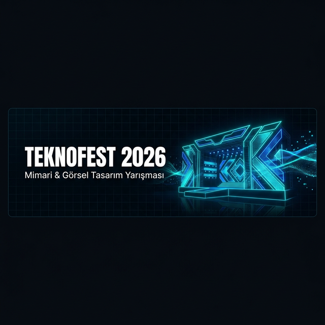
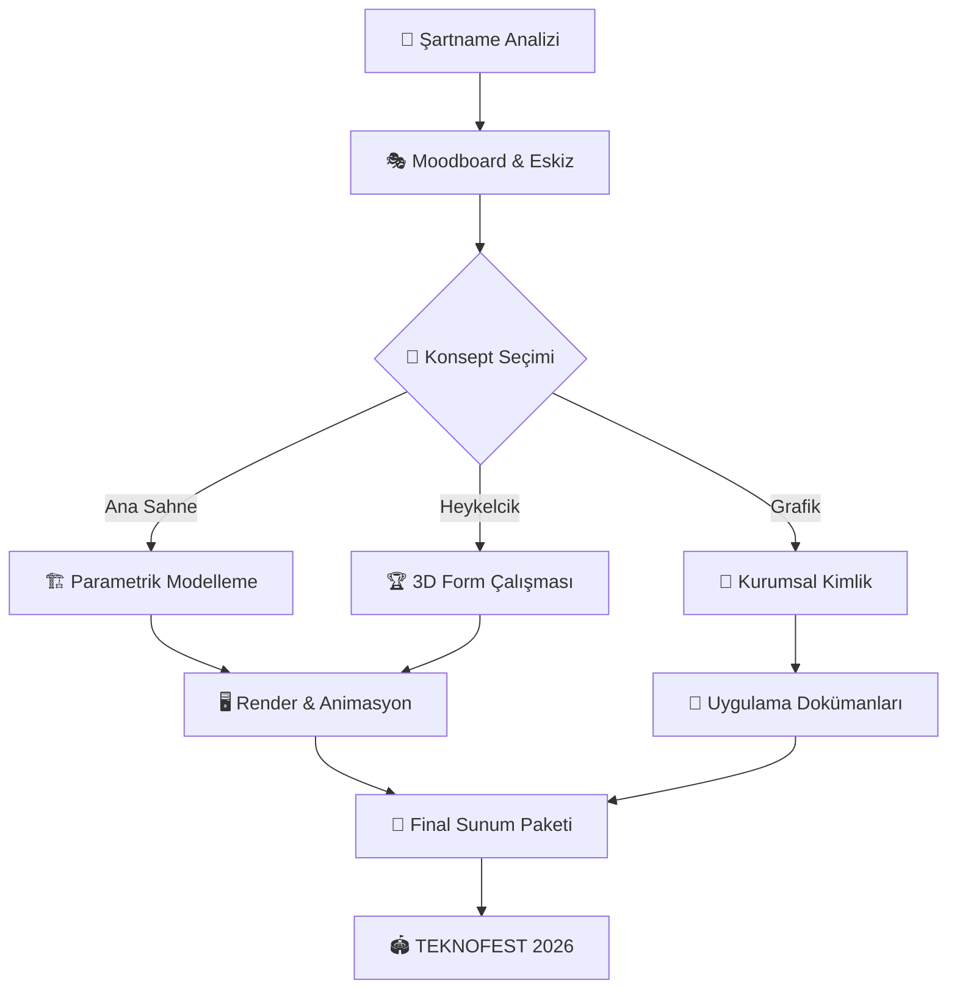

<p align="center">
  
</p>

# 🚀 TEKNOFEST 2026: Mimari ve Görsel Tasarım Yarışması


> *"Geleceğin TEKNOFEST'ini birlikte tasarlıyoruz — taş değil ışık, duvar değil akış, sahne değil evren."*

Bu depo, **TEKNOFEST 2026 Mimari ve Görsel Tasarım Yarışması** kapsamında geliştirilen tüm tasarım süreçlerini, kavramsal çalışmaları, teknik dokümanları ve proje varlıklarını barındırmaktadır.

---

## 📋 İçindekiler

- [Yarışma Hakkında](#-yarışma-hakkında)
- [Tasarım Felsefesi](#-tasarım-felsefesi)
- [Yarışma Kategorileri](#-yarışma-kategorileri)
- [Teknik Spesifikasyonlar](#-teknik-spesifikasyonlar)
- [Tasarım Araç Seti](#-tasarım-araç-seti)
- [Tasarım İş Akışı](#-tasarım-iş-akışı)
- [Dosya Yapısı](#-dosya-yapısı)
- [Konsept Görseller](#-konsept-görseller)
- [Rakip Analizi](#-rakip-analizi)
- [Katılım Koşulları](#-katılım-koşulları)
- [Ödüller](#-ödüller)
- [İletişim](#-iletişim)

---

## 🏛️ Yarışma Hakkında

TEKNOFEST; Havacılık, Uzay ve Teknoloji alanında kendini kanıtlamış bir festivalin **tasarım merkezli** yeni bir vizyonu benimsemesini hedefler. Bu yarışma kapsamında katılımcılardan:

- TEKNOFEST'e ait **yapılar, sahneler ve etkinlik alanlarını** tasarlamaları,
- Festivalin **kurumsal kimliğini ve görsel dilini** oluşturmaları,
- Başarının sembolü olacak **ödül heykelciklerini** hayata geçirmeleri

beklenmektedir.

> [!IMPORTANT]
> Yarışma açık alanda (havaalanı sahası) gerçekleşmektedir. Tüm tasarımlar **geçici yapı** niteliğinde olmalı ve belirlenen kurulum/söküm sürelerine uygun olmalıdır.

> [!NOTE]
> Katılımcılar; güzel sanatlar, mimarlık, iç mimarlık ve endüstriyel tasarım bölümü öğrencilerinden oluşabilir. Bireysel veya takım halinde başvuru yapılabilir.

---

## 🎨 Tasarım Felsefesi

Projemiz, **"Quantum-Fluidity"** (Kuantum Akışkanlığı) teması üzerine kuruludur.

Geleceğin mimarisini; sert çizgilerin dijital akışla buluştuğu, rüzgarla konuşan ve ışığı içselleştiren formlarda görüyoruz. Tasarımlarımız yalnızca bir yüzey değil; bir **deneyim manifestosu**dur.

```
Sürdürülebilirlik · Gelecekçilik (Futuromodernism) · Erişilebilirlik · Kinetik Mimari
```

---

## � Yarışma Kategorileri

### 1️⃣ TEKNOFEST Ana Sahne Tasarımı — *"The Nexus"*

Festivalin kalbi, enerjisinin yayıldığı merkez. Ana sahne; 55m genişliğiyle yalnızca bir performans platformu değil, bir **deneyim mimarisi**dir.

**Konsept Hedeflerimiz:**
- LED paneller ve holografik yüzeyler ile kesintisiz görsel deneyim
- Kinetik ve modüler yapı sistemi ile dinamik sahne konfigürasyonları
- Drone pistiyle entegre çatı katmanı
- Havaalanı sahasına uygun, rüzgara ve yağışa dayanıklı taşıyıcı çerçeve

**Teknik Sınırlar (Şartnameye Göre):**
- Maksimum genişlik: **55 m**
- Maksimum derinlik: **25 m**
- Maksimum yükseklik: **14 m**
- Podyum: min. **20m × 18m**, yükseklik **1.5 m**

---

### 2️⃣ TEKNOFEST Ödül Heykelciği — *"The Prism of Excellence"*

Başarının simgesi. Işığı kıran, sert ve yumuşak formları bir arada barındıran, üretim odaklı bir ödül tasarımı.

**Konsept Hedeflerimiz:**
- Şeffaf akrilik/reçine + fırçalanmış alüminyum hibrit malzeme
- İç LED aydınlatma ile "içten parlayan" efekt
- Aerodinamik ve roket formuna ilham veren soyut geometri
- Seri üretilebilir, çoğaltılabilir yapı mantığı

---

### 3️⃣ TEKNOFEST Grafik Konsept Tasarımı — *"Neon-Cyber Visual Identity"*

Festivalin dili. İç ve dış mekânda, ekranlarda ve basılı materyallerde tutarlı bir görsel evren oluşturmak.

**Kapsam:**
- Logo sistemi ve marka rehberi
- İç/dış mekân uygulamaları (tabela, yönlendirme, banner)
- Dijital ekran içerikleri ve animasyon kitaplığı
- Reklam ve sosyal medya şablonları

**Tema:** Dijital Dönüşüm → Geometrik akışlar, neon siyanı ve derin uzay siyahı

---

## 📐 Teknik Spesifikasyonlar

### Ana Sahne Ölçüleri

| Parametre | Değer | Açıklama |
| :--- | :---: | :--- |
| Maksimum Genişlik | **55 m** | Yapının yatay sınırı |
| Maksimum Derinlik | **25 m** | Yapının derinlik sınırı |
| Maksimum Yükseklik | **14 m** | Üst nokta |
| Podyum Genişliği | min. **20 m** | Aktif performans alanı |
| Podyum Derinliği | min. **18 m** | Aktif performans alanı |
| Podyum Yüksekliği | **1.5 m** | Zemin kotu farkı |
| Kurulum Süresi | maks. **7–10 gün** | Geçici yapı kısıtı |
| Söküm Süresi | maks. **7 gün** | Geçici yapı kısıtı |

> [!WARNING]
> Kalıcı yapı niteliği taşıyan hiçbir çözüm kabul edilmez. Tüm taşıyıcı sistemler sökülebilir olmalıdır.

---

## 🛠️ Tasarım Araç Seti

| Kategori | Araçlar | Amaç |
| :--- | :--- | :--- |
| **Mimari Modelleme** | Blender, Rhino 3D, AutoCAD | 3D Form ve Yapısal Tasarım |
| **Parametrik Tasarım** | Grasshopper (Rhino), Geometry Nodes | Matematiksel form üretimi |
| **Görselleştirme** | Unreal Engine 5, Twinmotion | Real-time Render ve Atmosfer |
| **Grafik Tasarım** | Adobe Illustrator, Figma | Kurumsal Kimlik ve UI/UX |
| **Aydınlatma Sim.** | Blender-DMX, Dialux | Profesyonel ışık simülasyonu |
| **Kavramsal Üretim** | Midjourney, Stable Diffusion | Moodboard ve Konsept |
| **Animasyon** | After Effects, Theatre.js | Sahne animasyonları |
| **Showcase App** | Vite + React + Framer Motion | İnteraktif sunum galerisi |

---

## 📈 Tasarım İş Akışı



---

## 📂 Dosya Yapısı

```text
teknofest_mimari_gorsel_tasarim/
│
├── 📁 assets/
│   └── 📁 concepts/              # AI-destekli konsept görseller
│       ├── 🖼️  main_stage.png    # Ana Sahne Konsepti
│       ├── �️  award_trophy.png  # Ödül Heykelciği Konsepti
│       └── 🖼️  brand_identity.png # Grafik Kimlik Konsepti
│
├── 📁 src/
│   ├── 📁 ana_sahne/             # Mimari modeller ve teknik çizimler
│   ├── 📁 odul_heykelcigi/       # 3D dosyalar ve malzeme tanımları
│   └── 📁 grafik_konsept/        # Vektörler, şablonlar, marka rehberi
│
├── 📁 docs/
│   ├── 📄 DESIGN_SYSTEM.md       # Renk, tipografi, tasarım ilkeleri
│   └── 📄 COMPETITOR_ANALYSIS.md # Rakip analizi ve stratejik öneriler
│
├── 📁 showcase/                  # Vite + React sunum galerisi
│   ├── 📁 src/                   # Uygulama kaynak kodları
│   └── 📁 public/                # Statik varlıklar
│
├── 📄 2026-TEKNOFEST_Mimari_ve_Görsel_Tasarım_Yarışması_Türkçe_Şartname.pdf
└── 📄 README.md
```

---

## 🖼️ Konsept Görseller

<table>
  <tr>
    <td align="center"><b>🏟️ Ana Sahne</b></td>
    <td align="center"><b>🏆 Ödül Heykelciği</b></td>
    <td align="center"><b>🎨 Grafik Kimlik</b></td>
  </tr>
  <tr>
    <td></td>
    <td></td>
    <td></td>
  </tr>
</table>

> Görseller, yarışma konsept aşamasında AI ile üretilmiş referans görsellerdir. Final tasarımlar Blender/Rhino 3D yazılımları ile üretilecektir.

---

## 🔍 Rakip Analizi (Competitive Intelligence)

Yarışmada fark yaratmak için benzer uluslararası projeler detaylı incelendi. Tam rapor: [COMPETITOR_ANALYSIS.md](./docs/COMPETITOR_ANALYSIS.md)

| Proje / Araç | Kategori | Stratejik Ders |
| :--- | :--- | :--- |
| **YU'RE-STAGE** (TEKNOFEST 2025) | Ana Sahne | "Işığı mimarileştirmek" → ışık bir form elemanıdır |
| **Wikihouse** | Modüler Yapı | CNC ahşap sistemi → hızlı kurulum/söküm referansı |
| **Theatre.js** | Animasyon | Web 3D sahne animasyonu → Showcase uygulaması için |
| **Blender-DMX** | Aydınlatma | Profesyonel DMX aydınlatma simülasyonu |
| **Git Trophy** | Ödül / 3D | Veri-odaklı algoritmik heykelcik yaklaşımı |
| **GitHub Primer Brand** | Tasarım Sistemi | Kimliğin sistematik ve kod-tabanlı uygulaması |

### 💡 Stratejik Avantajlarımız
1. **Parametrik Tasarım** → Blender Geometry Nodes ile matematiksel, üretim-dostu formlar.
2. **Dijital İkiz (Digital Twin)** → Alanın simülasyonu ile birlikte sunum.
3. **Hibrit Malzeme** → Şeffaf reçine + ham metalin kontrası, prizmik bir heykel.
4. **Kinetik Sahne** → Rüzgar/ışık ile etkileşime giren dinamik mimari unsurlar.

---

## � Katılım Koşulları

- **Hedef Kitle:** Güzel sanatlar, mimarlık, iç mimarlık, endüstriyel tasarım öğrencileri
- **Katılım Türü:** Bireysel veya takım
- **Takım Büyüklüğü:** Şartnamede belirtilen kurallara göre
- **Başvuru:** [teknofest.org](https://www.teknofest.org) üzerinden çevrimiçi

> [!TIP]
> Başvuru yapmadan önce resmi PDF şartnamesini (`2026-TEKNOFEST...pdf`) dikkatle okuyunuz. Tüm teknik kısıtlar ve teslimat gereklilikleri bu belgede detaylandırılmıştır.

---

## 🏅 Ödüller

Yarışmada 3 kategori için ayrı ödüller verilmektedir. Her bir kategoride:
- 🥇 **Birincilik Ödülü**
- 🥈 **İkincilik Ödülü**
- 🥉 **Üçüncülük Ödülü**
- 🎖️ **Sergileme Ödülleri**

Detaylı ödül tablosu için resmi şartnameyi inceleyiniz.

---

## 📞 İletişim

Yarışma ile ilgili teknik sorularınız için resmi kanallar:

- 🌐 **Web:** [www.teknofest.org](https://www.teknofest.org)
- 📧 Resmi iletişim formu üzerinden sorularınızı iletebilirsiniz.

---

<div align="center">

**© 2026 TEKNOFEST Mimari ve Görsel Tasarım Yarışması**

*Powered by Visionary Design Strategy · Quantum-Fluidity Theme*


</div>
